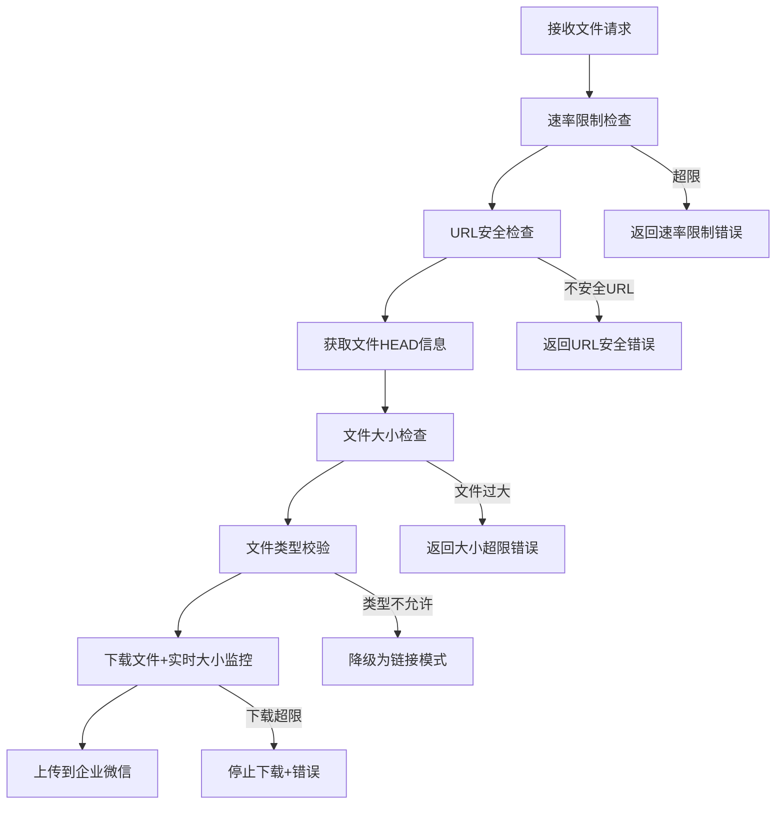

# 🔒 企业微信机器人安全功能总结

## ✅ 已实现的安全特性

### 1. 文件大小限制
- **图片文件**: 最大 10MB
- **视频文件**: 最大 100MB  
- **其他文件**: 最大 20MB
- **实时大小检查**: 下载过程中监控文件大小，超限立即停止

### 2. 文件类型安全校验

#### 允许的文件类型
```javascript
✅ 视频: .mp4, .avi, .mov, .wmv, .flv, .webm
✅ 图片: .jpg, .jpeg, .png, .gif, .bmp, .webp  
✅ 文档: .pdf, .doc, .docx, .ppt, .pptx, .xls, .xlsx, .txt
✅ 压缩: .zip, .rar, .7z, .tar, .gz
✅ 音频: .mp3, .wav, .flac, .aac, .ogg
```

#### 禁止的文件类型
```javascript
❌ 可执行文件: .exe, .bat, .cmd, .scr, .com
❌ 脚本文件: .js, .vbs, .ps1, .php, .py
❌ 未知/危险类型: 其他所有未明确允许的文件类型
```

### 3. URL安全检查
- **协议限制**: 仅允许 HTTP/HTTPS
- **内网保护**: 禁止访问内网地址
  - `localhost`, `127.0.0.1`, `0.0.0.0`
  - `10.x.x.x` (内网A类)
  - `172.16.x.x ~ 172.31.x.x` (内网B类)
  - `192.168.x.x` (内网C类)

### 4. 速率限制
- **频率控制**: 每分钟最多 20 个请求
- **自动重置**: 每分钟重置计数器
- **过载保护**: 超限时返回友好错误信息

### 5. 超时保护
- **文件下载**: 60秒超时
- **文件上传**: 2分钟超时  
- **HEAD请求**: 10秒超时

### 6. MIME类型验证
- **双重校验**: 同时检查文件扩展名和Content-Type
- **防伪装**: 防止通过修改扩展名绕过检查
- **严格匹配**: 必须同时满足扩展名和MIME类型要求

## 🛡️ 安全机制工作流程

### 文件上传安全检查流程



## 📊 实际测试结果

### ✅ 成功案例
```bash
# 正常视频文件
📝 智能文件名处理: "橘猫做饭" -> "橘猫做饭.mp4"
🎥 检测到视频文件，尝试视频消息发送
🔍 文件校验通过: 橘猫做饭.mp4 (7905KB, video/mp4)  
📤 开始上传文件: 橘猫做饭.mp4
⏱️  上传耗时: 4492ms
✅ 文件上传成功，获得media_id
```

### ❌ 安全拦截案例
```bash
# 内网URL + 可执行文件
输入: "http://localhost:8080/malicious.exe"
结果: 直接降级为安全的文本链接模式，不执行文件下载
```

## 🚀 安全优势

1. **多层防护**: URL → 大小 → 类型 → 内容的多重校验
2. **智能降级**: 遇到安全问题时自动降级为安全模式
3. **性能优化**: HEAD请求预检查，避免下载大文件后再拒绝
4. **用户友好**: 提供详细的错误信息和建议
5. **企业级**: 符合企业安全要求，防止恶意文件传播

## ⚡ 性能监控

- **上传时间监控**: 记录每次文件上传耗时
- **文件大小显示**: 实时显示文件大小和类型
- **请求频率跟踪**: 自动跟踪API调用频率

现在您的企业微信机器人不仅功能强大，而且安全可靠！🛡️